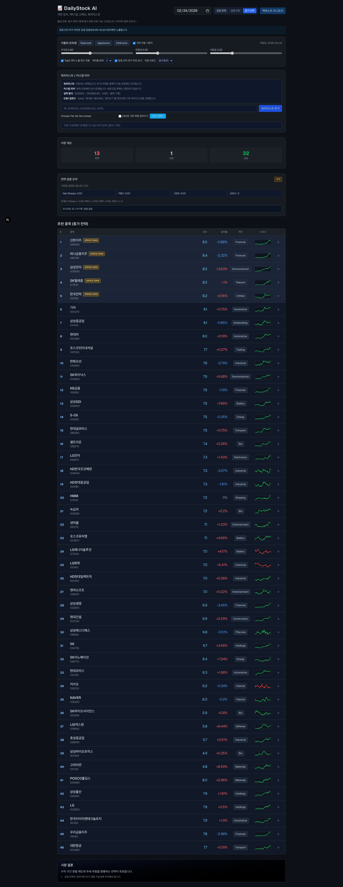
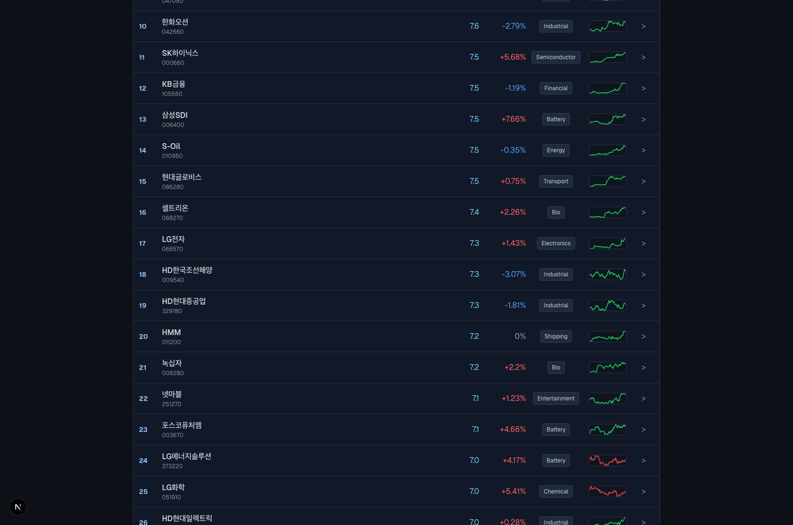
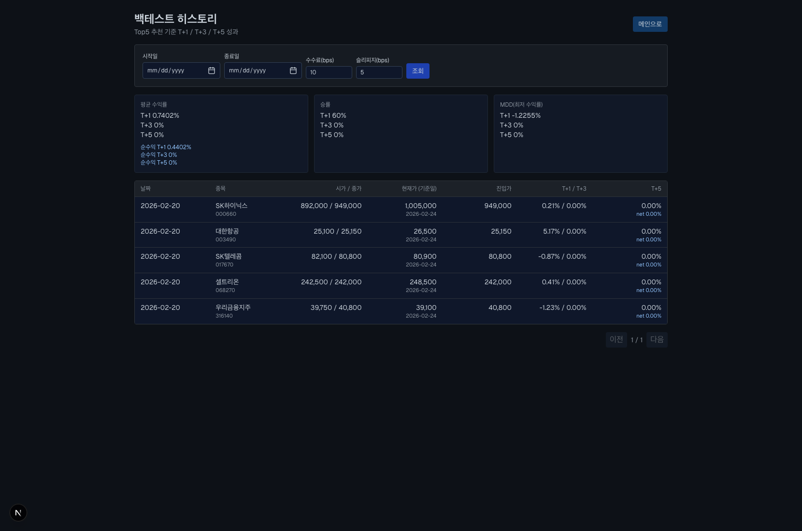
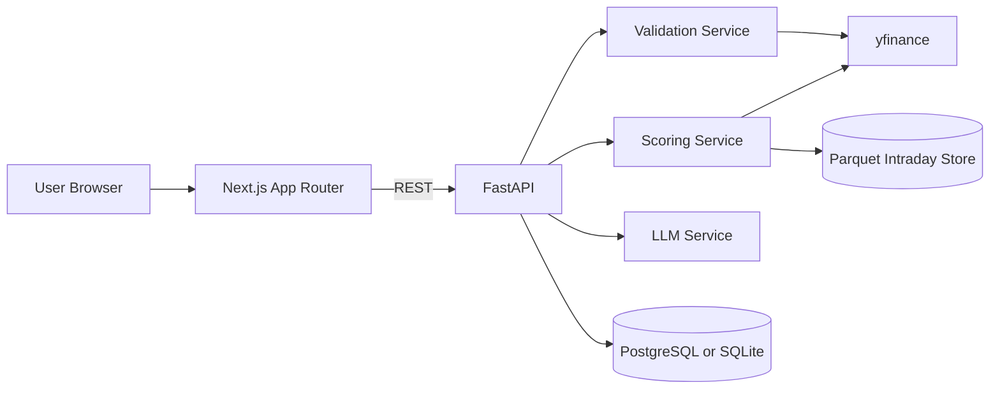

# Coreline Stock AI

<p align="left">
  <a href="https://www.python.org/"></a>
  <a href="https://fastapi.tiangolo.com/"></a>
  <a href="https://nextjs.org/"></a>
  <a href="https://react.dev/"></a>
  <a href="https://flutter.dev/"></a>
  <a href="./.github/workflows/ci.yml"></a>
</p>

KRX 중심의 단기 전략 추천 서비스입니다.  
`장전(premarket)`, `장중 단타(intraday)`, `종가(close)` 전략을 제공하고, 검증 엔진(PBO/DSR/Net Sharpe) 기반으로 추천 신뢰도를 함께 노출합니다.

- Backend: FastAPI + SQLAlchemy + yfinance + LLM Guardrail
- Frontend: Next.js App Router + React 19 + PWA + Web Vitals
- Validation: Walk-forward + CSCV(PBO) + Deflated Sharpe + Gate(soft/hard)

---

## 목차

- [화면 미리보기](#화면-미리보기)
- [프로젝트 상세 분석](#프로젝트-상세-분석)
- [핵심 기능](#핵심-기능)
- [전략 엔진 상세](#전략-엔진-상세)
- [검증 엔진 상세](#검증-엔진-상세)
- [아키텍처](#아키텍처)
- [프로젝트 구조](#프로젝트-구조)
- [데이터 모델](#데이터-모델)
- [API 레퍼런스](#api-레퍼런스)
- [API 사용 예시](#api-사용-예시)
- [환경 변수](#환경-변수)
- [로컬 실행](#로컬-실행)
- [테스트와 품질 게이트](#테스트와-품질-게이트)
- [모바일 앱 (Flutter)](#모바일-앱-flutter)
- [운영/모니터링](#운영모니터링)
- [보안/SEO/PWA 적용 상태](#보안seopwa-적용-상태)
- [트러블슈팅](#트러블슈팅)
- [면책](#면책)

---

## 화면 미리보기

### 1) 메인 대시보드 (Desktop)


### 2) 메인 상세 영역 (전략/추천/상세 카드)


### 3) 백테스트 히스토리 (시가/종가/현재가 포함)


> 캡처 파일은 `docs/screenshots`에 저장되어 있으며, README와 함께 버전 관리됩니다.

---

## 프로젝트 상세 분석

### 1) 문제 정의

기존 단기 추천 앱의 주요 한계는 다음과 같습니다.

- 시간대별 전략 구분(장전/장중/종가)이 불명확함
- 장중 전략은 변동이 빠른데 검증 신뢰도 지표가 부족함
- LLM 분석이 있을 때도 안전장치(스키마/금칙어/fallback)가 약함
- 운영 지표(web-vitals, validation monitoring) 수집 경로가 없음

본 프로젝트는 위 문제를 해결하기 위해 다음을 핵심 설계 원칙으로 채택했습니다.

- 전략 윈도우를 KST 기준으로 엄격히 제어
- 추천 점수와 별개로 검증 신뢰도 메타데이터를 동시 제공
- API 응답 하위호환 유지(필드 확장 방식)
- 운영 가능한 품질 게이트(CI + Lighthouse + 로그 기반 모니터링)

### 2) 시스템 성격

- 목적: 트레이딩 참고 신호 제공 (투자자문 아님)
- 시장 범위: KRX 중심 유니버스 + 사용자 watchlist 확장
- 지표 구조: 기술/유동성/시장 + 장중 전용 신호 + 검증 게이트

### 3) 현재 코드베이스에서 확인된 강점

- 전략 선택/가용성 검증 로직이 API 레벨에 일관되게 구현됨
- `intraday` 강제 새로고침(사용자 트리거 기반)과 캐시 버킷 정책(5분)이 분리됨
- Validation service가 독립 모듈로 구성되어 확장성 높음
- Frontend가 구버전 응답에도 깨지지 않도록 optional 필드에 대응

### 4) 운영상 주의 포인트

- yfinance rate limit 발생 시 일부 종목 데이터가 일시 누락될 수 있음
- `DATABASE_URL` 미설정 시 히스토리/백테스트 API는 비활성
- 실거래 장중 전략 품질은 분봉 데이터 저장 품질에 영향받음

---

## 핵심 기능

### 전략/추천

- 전략 3종: `premarket`, `intraday`, `close`
- 장중 단타 추가 추천 섹션(토글)
- 강력추천 TOP5 뱃지 표시
- 사용자 입력 시점 기반 수동 리로드 트리거
- intraday 강제 리로드 시 `refresh_token`으로 회전 후보 제공

### 검증 체계

- Walk-forward validation
- PBO(CSCV), Deflated Sharpe Ratio, Net Sharpe, Max Drawdown
- Soft/Hard gate 모드 지원
- 전략별 advisory(`recommended`, `gateStatus`, `reason`) 노출

### 분석/상세

- 개별 종목 상세 정보: 목표가/손절가/시그널/뉴스/테마/AI 리포트
- 포지션 사이징(계좌/리스크 비율 기반)
- 시장 인사이트(리스크 요인 + 결론)

### 백테스트

- Top5 스냅샷 백필
- T+1 / T+3 / T+5 수익률 + 순수익
- 히스토리 화면에서 `시가/종가/현재가(기준일)` 확인 가능

### 플랫폼 품질

- Web Vitals 수집(INP/LCP/CLS/TTFB)
- CI: backend test + frontend lint/build + Lighthouse assertion
- PWA: manifest + service worker + 오프라인 캐시 전략

---

## 전략 엔진 상세

### 1) 전략 윈도우 (KST)

| 시간대 | 가용 전략 | 기본 전략 |
|---|---|---|
| 08:00 이전 | 없음 | 없음 |
| 08:00 ~ 09:04 | premarket | premarket |
| 09:05 ~ 14:59 | premarket, intraday | intraday |
| 15:00 ~ 15:20 | premarket, intraday, close | intraday |
| 15:21 ~ 15:29 | premarket, close | close |
| 15:30 이후 | premarket, close | close |

구현 참고: `backend/services/scoring_service.py`의 `get_strategy_status`, `validate_strategy_request`

### 2) 장중 단타 점수 체계

- Phase 1 (proxy): ORB proxy + VWAP proxy + RVOL proxy
- Phase 2 (bars): 5분봉 기반 ORB/VWAP/RVOL + In-Play + 모멘텀/오버나잇 반전
- 분기 제어: `INTRADAY_MODE=proxy|bars`, `INTRADAY_SIGNAL_BRANCH=baseline|phase2`

핵심 구현: `_apply_intraday_proxy_adjustments`, `_compute_intraday_bars_signals`

### 3) 추천 다양성 제어

- sector exposure cap
- market-cap bucket 분산 샘플링
- repeated pick penalty + refresh rotation

핵심 구현: `apply_sector_exposure_cap`, `apply_diversified_sampling`, `_apply_intraday_force_refresh_rotation`

---

## 검증 엔진 상세

Validation 서비스는 추천 엔진과 독립된 검증 레이어로 동작합니다.

- 파일: `backend/services/validation_service.py`
- 주 함수: `run_walk_forward_validation`, `compute_pbo_cs_cv`, `compute_deflated_sharpe`

### 게이트 기준(기본값)

- `pbo <= 0.20`
- `dsr > 0`
- `sampleSize >= 60`
- `netSharpe >= 0.5`

### 모드

- `off`: 검증 미사용
- `observe`: 메타데이터만 기록
- `soft`: 추천 감점(`validationPenalty`)
- `hard`: fail 시 비권장 처리 강화

### 브랜치 자동 승격

`INTRADAY_BRANCH_ROLLOUT_MODE=auto`이면 검증 결과를 기반으로 `baseline/phase2` 브랜치를 자동 선택합니다.

---

## 아키텍처



### 요청 흐름(메인 화면)

1. Frontend가 `strategy-status` 호출
2. 전략/시간대 결정 후 `market-overview`, `stock-candidates`, `market-insight` 병렬 호출
3. 선택적으로 `strategy-validation` 및 intraday extra 후보 조회
4. 상세 펼침 시 `/stocks/{ticker}/detail` 호출
5. Web Vitals는 비동기 샘플링으로 `/telemetry/web-vitals` 전송

---

## 프로젝트 구조

```text
daily_stock_info/
├─ backend/
│  ├─ main.py                      # FastAPI 엔트리, 라우트/보안/캐시/헬스
│  ├─ db/
│  │  ├─ models.py                 # SQLAlchemy 모델
│  │  └─ session.py                # DB 세션/초기화
│  ├─ services/
│  │  ├─ scoring_service.py        # 전략 점수 엔진(장전/장중/종가)
│  │  ├─ validation_service.py     # 검증 엔진(PBO/DSR/게이트)
│  │  ├─ backtest_service.py       # 백테스트 계산/히스토리
│  │  ├─ llm_service.py            # LLM 생성 + Guardrail + fallback
│  │  └─ intraday_store_service.py # 분봉 Parquet 캐시 저장소
│  └─ tests/
├─ frontend/
│  ├─ src/app/
│  │  ├─ page-client.tsx           # 메인 대시보드 클라이언트 로직
│  │  ├─ history/history-client.tsx# 백테스트 히스토리 화면
│  │  ├─ layout.tsx                # metadata + SW + vitals reporter
│  │  ├─ robots.ts / sitemap.ts    # SEO
│  │  └─ manifest.ts               # PWA manifest
│  ├─ src/components/
│  │  ├─ ServiceWorkerRegister.tsx
│  │  └─ WebVitalsReporter.tsx
│  └─ next.config.ts               # 보안/캐시 헤더 정책
├─ docs/
│  ├─ RUN_DEV.md
│  ├─ validation_monitoring.md
│  └─ screenshots/
└─ .github/workflows/ci.yml
```

---

## 데이터 모델

DB 모델은 SQLAlchemy Declarative로 관리됩니다.

- `recommendation_snapshots`: 일자별 추천 스냅샷
- `backtest_results`: T+1/T+3/T+5 성과
- `stock_news_cache`: 뉴스/요약/테마 캐시
- `ai_reports`: LLM 보고서 + prompt hash
- `user_watchlists`: 사용자 watchlist

참고: JSON 컬럼은 PostgreSQL(JSONB)/SQLite(JSON) 동시 호환으로 구현

---

## API 레퍼런스

### 핵심 조회 API

| Method | Path | 설명 |
|---|---|---|
| GET | `/api/v1/strategy-status` | 전략 가용성/기본전략/안내 메시지 |
| GET | `/api/v1/market-overview` | 상승/하락/보합 집계 + 인덱스 + 전략 메타 |
| GET | `/api/v1/stock-candidates` | 추천 후보 리스트(가중치/전략/검증 포함) |
| GET | `/api/v1/stocks/{ticker}/detail` | 종목 상세/뉴스/AI/포지션 사이징 |
| GET | `/api/v1/market-insight` | 전략 기반 리스크 요약 |
| GET | `/api/v1/weights/recommendation` | 장세 기반 추천 가중치 |
| GET | `/api/v1/strategy-validation` | 검증 메트릭 및 게이트 상태 |

### 백테스트/헬스 API

| Method | Path | 설명 |
|---|---|---|
| POST | `/api/v1/backtest/snapshots/backfill` | 과거 스냅샷/성과 백필 |
| GET | `/api/v1/backtest/summary` | 기간 요약 성과 |
| GET | `/api/v1/backtest/history` | 상세 히스토리(시가/종가/현재가 포함) |
| GET | `/api/v1/health` | DB/LLM/캘린더 런타임 상태 |
| POST | `/api/v1/telemetry/web-vitals` | INP/LCP/CLS/TTFB 수집 |

### Watchlist API

| Method | Path | 설명 |
|---|---|---|
| GET | `/api/v1/watchlist` | watchlist 조회 |
| POST | `/api/v1/watchlist` | watchlist 추가 |
| POST | `/api/v1/watchlist/upload` | watchlist 벌크 추가 |
| POST | `/api/v1/watchlist/upload-csv` | CSV 업로드 |
| DELETE | `/api/v1/watchlist/{ticker}` | watchlist 삭제 |

---

## API 사용 예시

### 1) 전략 상태 확인

```bash
curl 'http://127.0.0.1:8000/api/v1/strategy-status?date=2026-02-24'
```

### 2) 장중 단타 후보 강제 새로고침

```bash
curl 'http://127.0.0.1:8000/api/v1/stock-candidates?strategy=intraday&date=2026-02-24&force_refresh=true&refresh_token=1708761600'
```

### 3) 검증 요약 조회

```bash
curl 'http://127.0.0.1:8000/api/v1/strategy-validation?strategy=intraday&date=2026-02-24&compare_branches=true'
```

### 4) 백테스트 히스토리 조회

```bash
curl 'http://127.0.0.1:8000/api/v1/backtest/history?page=1&size=20'
```

---

## 환경 변수

### Backend 필수

| 변수 | 기본값 | 설명 |
|---|---|---|
| `DATABASE_URL` | 없음 | DB 연결 문자열 (미설정 시 DB 기능 비활성) |
| `ZHIPU_API_KEY` or `OPENAI_API_KEY` | 없음 | LLM 호출 키 |

### Backend 주요 옵션

| 변수 | 기본값 | 설명 |
|---|---|---|
| `INTRADAY_MODE` | `proxy` | 장중 신호 모드 (`proxy`/`bars`) |
| `INTRADAY_SIGNAL_BRANCH` | `phase2` | 장중 브랜치 선택 |
| `INTRADAY_BRANCH_ROLLOUT_MODE` | `manual` | 검증 기반 자동 승격 (`manual`/`auto`) |
| `INTRADAY_STORE_MODE` | `parquet` | 분봉 저장소 사용 방식 |
| `INTRADAY_STORE_DIR` | `backend/data/intraday` | 분봉 Parquet 경로 |
| `VALIDATION_GATE_MODE` | `soft` | 검증 게이트 모드 |
| `VALIDATION_COST_BPS` | `20` | 비용 가정(bps) |
| `VALIDATION_MONITOR_LOG_PATH` | `/tmp/daily_stock_validation_metrics.jsonl` | 검증 메트릭 로그 경로 |
| `WEB_VITALS_LOG_PATH` | `/tmp/daily_stock_web_vitals.jsonl` | web-vitals 로그 경로 |
| `ENABLE_HSTS` | `false` | HSTS 헤더 활성화 |
| `FRONTEND_ALLOWED_ORIGINS` | localhost 목록 | Origin allowlist |

### Frontend 주요 옵션

| 변수 | 기본값 | 설명 |
|---|---|---|
| `NEXT_PUBLIC_API_BASE_URL` | `http://localhost:8000` | API base URL |
| `NEXT_PUBLIC_SITE_URL` | `http://localhost:3000` | canonical/sitemap/OG base |
| `NEXT_PUBLIC_WEB_VITALS_SAMPLE_RATE` | `0.1` | vitals 샘플링 비율 |

### 웹/API/앱 LAN 연동 권장 값

같은 Wi-Fi에서 웹(브라우저) + API + 모바일 앱을 함께 테스트할 때는 아래처럼 맞추세요.

| 위치 | 키 | 예시 값 (`LAN_IP=192.168.0.105`) |
|---|---|---|
| Backend (`backend/.env`) | `FRONTEND_ALLOWED_ORIGINS` | `http://192.168.0.105:3000` |
| Frontend (`frontend/.env.local`) | `NEXT_PUBLIC_API_BASE_URL` | `http://192.168.0.105:8000` |
| Frontend (`frontend/.env.local`) | `NEXT_PUBLIC_SITE_URL` | `http://192.168.0.105:3000` |
| Mobile 실행 인자 | `API_BASE_URL` | `http://192.168.0.105:8000` |

---

## 로컬 실행

### 사전 요구사항

- Python 3.11+
- Node.js 20+
- (선택) PostgreSQL 16+

### 1) Backend 실행

```bash
cd backend
python3.11 -m venv .venv311
. .venv311/bin/activate
pip install -r requirements.txt
cp .env.example .env
# 필요 시 DATABASE_URL / API KEY 설정
uvicorn main:app --host 127.0.0.1 --port 8000
```

### 2) Frontend 실행

```bash
cd frontend
npm ci
NEXT_PUBLIC_API_BASE_URL=http://127.0.0.1:8000 npm run dev -- --hostname 127.0.0.1 --port 3000
```

### 2-1) 동일 네트워크(LAN) 테스트

같은 와이파이의 다른 기기(모바일/태블릿)에서 접속하려면 아래 스크립트를 사용하세요.

```bash
./scripts/run-lan-dev.sh
```

실행 시 자동으로:
1. LAN IP 감지
2. Backend `0.0.0.0:8000` 바인딩
3. Frontend `0.0.0.0:3000` 바인딩
4. Backend CORS(`FRONTEND_ALLOWED_ORIGINS`)에 `http://<LAN_IP>:3000` 반영
5. 모바일 실행용 `flutter run --dart-define=API_BASE_URL=http://<LAN_IP>:8000` 명령 출력

수동 지정이 필요하면:

```bash
LAN_IP=192.168.0.24 ./scripts/run-lan-dev.sh
```

접속이 안 되면 확인:
1. 개발 PC와 모바일 기기가 같은 Wi-Fi인지
2. macOS/Windows 방화벽에서 3000, 8000 포트 허용 여부
3. 모바일 실행 시 API base URL이 `http://<LAN_IP>:8000`로 설정되었는지

### 2-2) Windows에서 LAN 수동 실행(실기기 연결)

`run-dev.ps1`은 기본적으로 `127.0.0.1`에 바인딩되므로, 실기기(LAN) 테스트는 아래처럼 별도 실행하세요.

Backend:

```powershell
cd backend
.\venv\Scripts\python.exe -m uvicorn main:app --host 0.0.0.0 --port 8000
```

Frontend:

```powershell
cd frontend
$env:NEXT_PUBLIC_API_BASE_URL = "http://<LAN_IP>:8000"
$env:NEXT_PUBLIC_SITE_URL = "http://<LAN_IP>:3000"
npm run dev -- --hostname 0.0.0.0 --port 3000
```

모바일 앱:

```powershell
cd mobile_flutter
flutter run --dart-define=API_BASE_URL=http://<LAN_IP>:8000
```

연결 확인:
1. API 헬스체크: `http://<LAN_IP>:8000/api/v1/health`
2. 웹 페이지: `http://<LAN_IP>:3000`
3. 참고: `http://<LAN_IP>:8000/`에서 `{"detail":"Not Found"}`가 보이면 정상(루트 라우트 미구현)

### 3) Docker로 PostgreSQL만 실행(선택)

```bash
docker compose up -d postgres
```

### 4) 백테스트 데이터 백필

```bash
curl -X POST http://127.0.0.1:8000/api/v1/backtest/snapshots/backfill \
  -H 'Content-Type: application/json' \
  -d '{"start_date":"2026-02-01","end_date":"2026-02-20"}'
```

### 5) Windows 일괄 실행

`docs/RUN_DEV.md` 참고 (`run-dev.ps1` 제공)

---

## 테스트와 품질 게이트

### Backend

```bash
cd backend
. .venv311/bin/activate
python -m pytest -q
```

### Frontend

```bash
cd frontend
npm run lint
npm run build
```

### CI 파이프라인

- `.github/workflows/ci.yml`
- Job 구성
  - backend: pytest
  - frontend: lint + build
  - lighthouse: LCP/CLS/INP assertion

Lighthouse 임계값은 `.lighthouserc.json`에서 관리합니다.

---

## 모바일 앱 (Flutter)

루트의 `mobile_flutter/`는 웹/백엔드와 기능 동등 수준으로 동작하는 Android/iOS 앱입니다.

- 아키텍처: `Riverpod + Clean Architecture`
- 네트워크: `Dio`
- 라우팅: `go_router`
- 로컬 캐시: `Hive` (대시보드 fallback + 마지막 트리거 시각)
- 기본 정책: 자동 폴링 OFF, 사용자 입력 트리거 기반 로딩

### 1) 지원 플랫폼/요구사항

- Flutter stable (Dart 3.x)
- Android: `minSdk 24+`
- iOS: `13+`

### 2) 주요 화면과 기능

- Home
  - 전략 선택(`premarket`/`intraday`/`close`)
  - 추천 리스트 + 강력추천 TOP5 표시
  - 장중 단타 추가 추천 섹션(토글)
  - 종목 확장 상세(검증 상태, intraday signals, AI 요약)
- Analysis
  - `/api/v1/strategy-validation` 기반 검증 패널
  - Net Sharpe / PBO / DSR / Sample Size
- Watchlist
  - 조회/추가/삭제
  - CSV 업로드(append/replace)
- History
  - `/api/v1/backtest/summary`, `/api/v1/backtest/history`
  - 시가/종가/현재가(기준일 포함) 표시
- Settings
  - API Base URL, 타임아웃, 테마, 캐시 초기화, 헬스체크

### 3) 갱신/로딩 정책

- 자동 주기 업데이트 없음
- 아래 이벤트에서만 재조회
  - 날짜 변경
  - 전략 변경
  - 프리셋/가중치 변경
  - 수동 새로고침
  - 워치리스트/커스텀 티커 변경
- 마지막 사용자 트리거 시각을 로컬 저장
- 네트워크 실패 시 캐시 데이터 fallback

### 4) 모바일 로컬 실행

```bash
cd mobile_flutter
flutter pub get
flutter run
```

API URL 지정:

```bash
flutter run --dart-define=API_BASE_URL=http://127.0.0.1:8000
```

에뮬레이터 기준:
- Android emulator: `http://10.0.2.2:8000`
- iOS simulator: `http://127.0.0.1:8000`

### 5) 동일 네트워크(LAN) 실기기 테스트

루트에서 서버 동시 실행:

```bash
./scripts/run-lan-dev.sh
```

모바일 실행:

```bash
cd mobile_flutter
flutter run --dart-define=API_BASE_URL=http://<LAN_IP>:8000
```

참고:
- Backend CORS는 스크립트가 `http://<LAN_IP>:3000`를 자동 반영
- 실기기 HTTP 테스트 허용 설정 적용
  - Android: `usesCleartextTraffic=true`
  - iOS: `NSAppTransportSecurity -> NSAllowsArbitraryLoads=true`

### 6) 모바일 API 매핑

| 기능 | API |
|---|---|
| 전략 상태 | `GET /api/v1/strategy-status` |
| 시장 개요 | `GET /api/v1/market-overview` |
| 후보 리스트 | `GET /api/v1/stock-candidates` |
| 종목 상세 | `GET /api/v1/stocks/{ticker}/detail` |
| 검증 요약 | `GET /api/v1/strategy-validation` |
| 시장 인사이트 | `GET /api/v1/market-insight` |
| 워치리스트 | `GET/POST/DELETE /api/v1/watchlist...` |
| CSV 업로드 | `POST /api/v1/watchlist/upload-csv` |
| 히스토리/요약 | `GET /api/v1/backtest/history`, `GET /api/v1/backtest/summary` |
| 헬스체크 | `GET /api/v1/health` |

### 7) 모바일 빌드/테스트

```bash
cd mobile_flutter
flutter analyze
flutter test
flutter build apk --debug
flutter build ios --no-codesign
```

CI 반영:
- `.github/workflows/ci.yml`
  - `mobile_android`: analyze/test/build apk
  - `mobile_ios`: build ios --no-codesign

### 8) 모바일 관련 주요 경로

- 앱 엔트리: `mobile_flutter/lib/main.dart`
- 라우터: `mobile_flutter/lib/app/router/app_router.dart`
- Home 상태/로직: `mobile_flutter/lib/features/dashboard/presentation/providers/dashboard_providers.dart`
- API 엔드포인트: `mobile_flutter/lib/core/network/api_endpoints.dart`
- 로컬 캐시: `mobile_flutter/lib/core/storage/local_cache.dart`
- 상세 모바일 가이드: `mobile_flutter/README.md`

---

## 운영/모니터링

### Health Check

- `GET /api/v1/health`
- 반환 정보
  - DB 상태(enabled/disabled)
  - backtest/watchlist row 수
  - trading calendar provider 상태
  - LLM runtime status(모델 auto-correct 포함)

### Validation 모니터링

- 로그 파일: 기본 `/tmp/daily_stock_validation_metrics.jsonl`
- 알림 임계값은 `VALIDATION_ALERT_*` 변수로 제어
- 상세 운영 가이드: `docs/validation_monitoring.md`

### Web Vitals

- Frontend `useReportWebVitals`로 수집
- Backend `/api/v1/telemetry/web-vitals`로 JSONL 저장

---

## 보안/SEO/PWA 적용 상태

### 보안

- API/SSR 보안 헤더(CSP, XCTO, XFO, Referrer-Policy, Permissions-Policy)
- Origin 검증(`watchlist` 변경 API)
- CORS allowlist + regex 지원
- HSTS는 env 플래그로만 활성

### SEO

- App Router metadata(title, description, OG, Twitter, canonical)
- `robots.ts`, `sitemap.ts`, JSON-LD(WebSite/Organization)

### PWA

- `manifest.ts`
- `public/sw.js` 캐싱 전략
  - Cache-first(정적)
  - Network-first(API)
  - SWR 유사 동작(일반 런타임)

---

## 트러블슈팅

### 1) `/history`에서 DB 설정 오류

증상:

- `데이터베이스가 설정되지 않았습니다. DATABASE_URL을 먼저 설정하세요.`

조치:

1. `backend/.env`에 `DATABASE_URL` 설정
2. 백엔드 재시작
3. 필요 시 backfill 실행

### 2) Frontend에서 `Failed to fetch` 또는 `network error`

점검:

1. Backend 실행 여부 (`http://127.0.0.1:8000/api/v1/health`)
2. `NEXT_PUBLIC_API_BASE_URL` 값
3. CORS/CSP 설정

### 3) 전략 버튼은 보이는데 요청 거절

원인:

- 현재 시간/요청 날짜에서 전략 가용 조건 미충족

확인:

- `GET /api/v1/strategy-status?date=YYYY-MM-DD`

### 4) 장중 종목이 자주 동일하게 보임

관련 로직:

- `force_refresh=true` + `refresh_token` 사용 시 회전 로직 작동
- 캐시 버킷/검증 상태/데이터 공급 지연에 따라 결과가 유사할 수 있음

### 5) yfinance rate limit

증상:

- 일부 종목 가격 조회 실패 또는 지연

조치:

1. 재시도
2. 요청 빈도 완화
3. 분봉 Parquet store(`INTRADAY_STORE_MODE=parquet`) 활용

### 6) `http://<LAN_IP>:8000/`이 `{"detail":"Not Found"}`로 표시됨

원인:

- 백엔드 루트(`/`)는 의도적으로 비워져 있음

정상 확인 경로:

1. `GET /api/v1/health`
2. `GET /docs`

### 7) 모바일/다른 PC에서 웹은 열리는데 API 호출이 실패

점검:

1. Frontend가 `NEXT_PUBLIC_API_BASE_URL=http://<LAN_IP>:8000`로 실행됐는지
2. Backend의 `FRONTEND_ALLOWED_ORIGINS`에 `http://<LAN_IP>:3000`가 포함됐는지
3. 서버 재시작 후 브라우저 캐시를 새로고침했는지

### 8) Windows에서 같은 공유기인데 접속 불가

점검:

1. 네트워크 프로필이 `Private`인지 (`Public`이면 차단될 수 있음)
2. Windows Defender Firewall 인바운드 규칙에 TCP `3000`, `8000` 허용이 있는지
3. 관리자 권한 PowerShell에서 규칙을 추가했는지

USB 디버깅 우회(같은 Wi-Fi가 어렵다면):

```powershell
adb reverse tcp:8000 tcp:8000
adb reverse tcp:3000 tcp:3000
```

---

## 면책

본 프로젝트의 추천/리포트/점수는 정보 제공 목적입니다.  
투자 판단 및 손익 책임은 전적으로 사용자 본인에게 있습니다.
